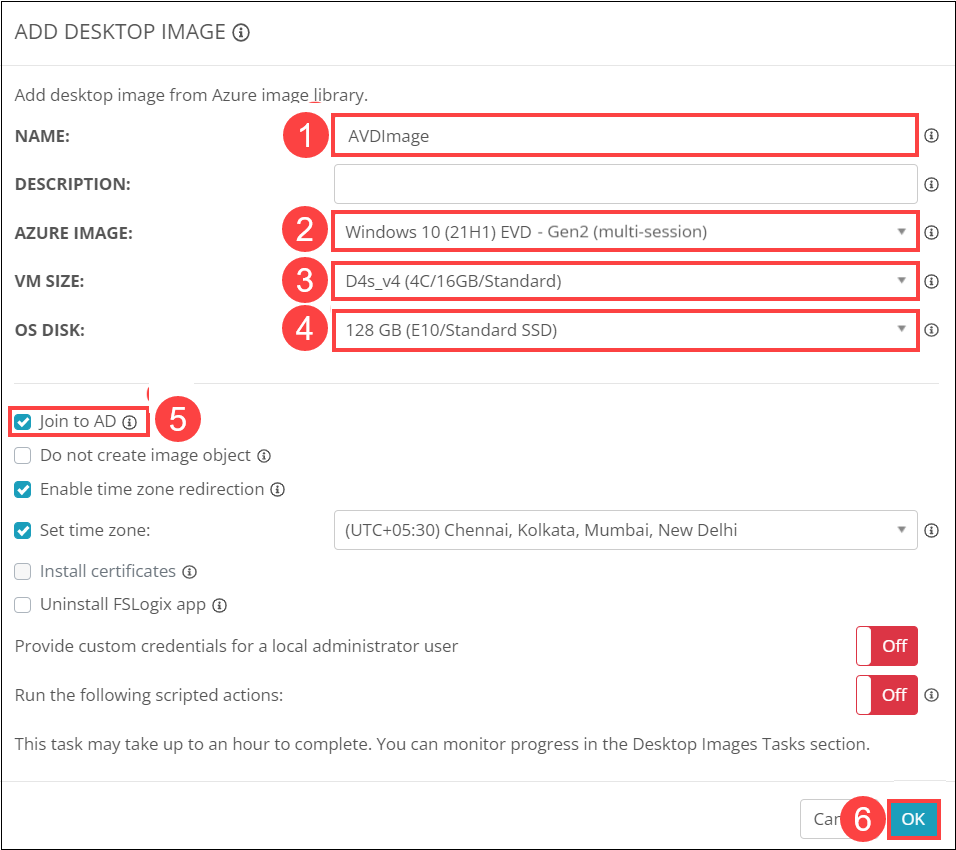
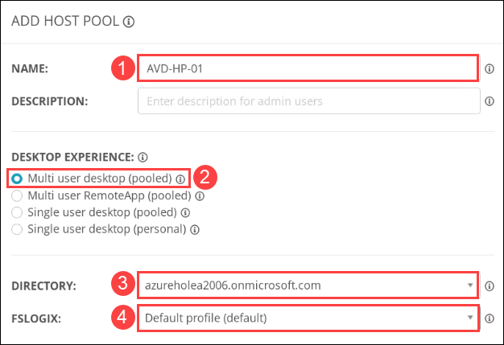
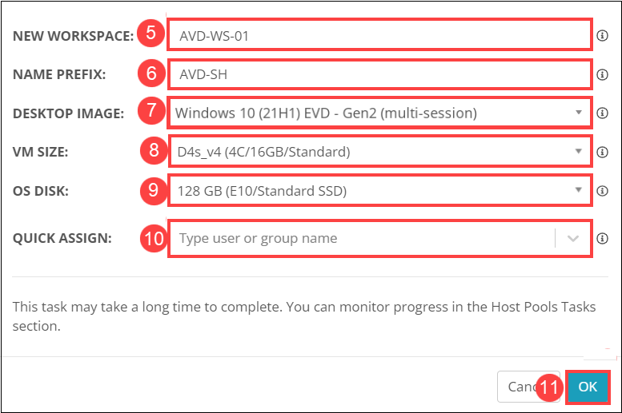
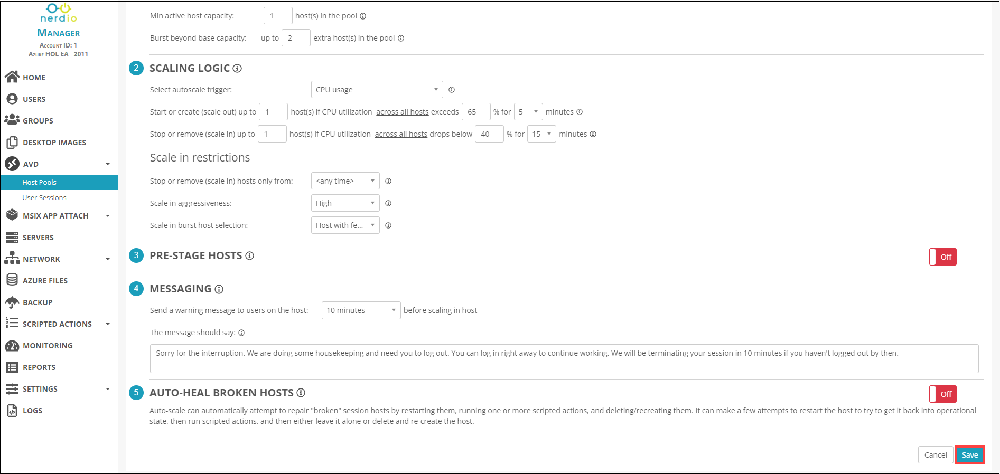
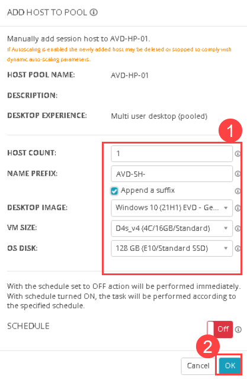

# Lab 2: Create Desktop Image and Host pool

## Overview

Host pools are groups of Azure VMs that "host" the Azure Virtual Desktops that end-users log into. All VMs in the host pool share a set of configuration options: VM size, base image, AD domain, user profile storage location, etc. Nerdio Manager for MSP supports four different types of host pools. The four types vary by the "desktop experience." The types of host pools are: 
* Multi-User Desktop (Pooled)
* Multi-User RemoteApp (Pooled)
* Single User Desktop (Pooled)
* Single User Desktop (Personal)

In this lab, We'll be creating a desktop image and a host pool in your NMM Account.

## Exercise 1: Create Desktop Image

In this exercise, We'll be creating a Desktop Image as per the specifications in your NMM Account.

1. In the NMM portal, Under **Accounts** ***(1)*** from the side blade and click on **Manage** ***(2)*** next to the default NMM Account which we created in Lab 1.

   
   
1. Select **DESKTOP IMAGES** ***(1)*** from the left-hand side blade and click on **Add from Azure library** ***(2)*** to create a new image.

      
   
1. Provide the following details to add a desktop image, then click on **OK** ***(6)***.

   - NAME: **AVDImage** ***(1)***
   - AZURE IMAGE: **Windows 10 (21H1) EVD - Gen2 (multi-session)** ***(2)***
   - VM SIZE: **D4s_v4 (4C/16GB/Standard)** ***(3)***
   - OS DISK: **128GB (E10/Standard SSD)** ***(4)***
   - Check **Join to AD** ***(5)***

   
   
   >**NOTE:** Image creation will take 25 to 30 minutes. You can continue with the lab as the image won't be used for host pool creation.

You can verify the status of image creation process as in **(1)** and also view details by clicking on **(2)**.

   

Details page would appear as below-

   
   
1. Once the image creation is completed. You'll be able to see the image in the Desktop image-side blade.

   
   
## Exercise 2: Create a Host Pool

In this exercise, We'll be creating a Multi-User Desktop (Pooled) AVD Host pool as per the specifications in the NMM Account.
   
1. In the NMM portal, Click on **AVD** ***(1)*** and Select **Host Pools** ***(2)*** from the left-hand side blade.

   
   
1. Click on **Add host pool** to create a new host pool.

   
   
1. Provide the following details to create the new host pool, then click on **OK** ***(11)***

   - NAME: **AVD-HP-01** ***(1)***
   - DESKTOP EXPERIENCE: Select **Multi user desktop (pooled)** ***(2)***
   - DIRECTORY: Select **<inject key="Tenant FQDN" />** ***(1)*** from the drop down 
   - FSLOGIX: **Default profile (default)** ***(4)*** from the drop down  

   
   
   - NEW WORKSPACE: **AVD-WS-01** ***(5)***
   - NAME PREFIX: **AVD-SH** ***(6)***
   - DESKTOP IMAGE: **Windows 10 (21H1) EVD - Gen2 (multi-session)** ***(7)***
   - VM SIZE: **D4s_v4 (4C/16GB/Standard)** ***(8)***
   - OS DISK: **128GB (E10/Standard SSD)** ***(9)***
   - QUICK ASSIGN: **Leave it to default** ***(10)***
   
   

   On the **Manage AUTO-SCALE AVD-HP-01** page, Leave all the options to *default* and click on **Save**.
 
   
   
1. Once the host pool creation completes. You'll be able to see the **AVD-HP-01** ***(1)*** host pool. Now on click on **Manage Hosts** ***(2)***.

   
   
1. Now on the SESSION HOSTS (AVD-HP-01) page, Click on **Add Session host**.

   
   
1. Under ADD HOST TO POOL provide the following details, then click on **OK** ***(2)***

   - HOST COUNT: **1**
   - NAME PREFIX: **AVD-SH-** 
   - DESKTOP IMAGE: **Windows 10 (21H1) EVD - Gen2 (multi-session)** 
   - VM SIZE: **D4s_v4 (4C/16GB/Standard)** 
   - OS DISK: **128GB (E10/Standard SSD)** 

   
   
   >**NOTE**: Session hosts creation will take around 30 to 40 minutes to complete. You can continue with the lab.
    
 1. Click on the **Next** button present in the bottom-right corner of this lab guide.
   

