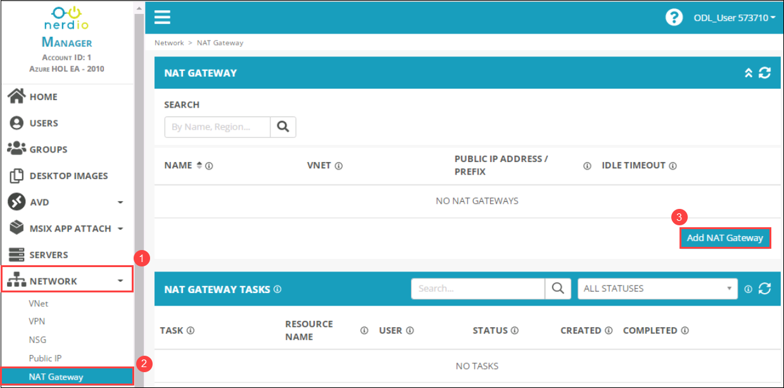
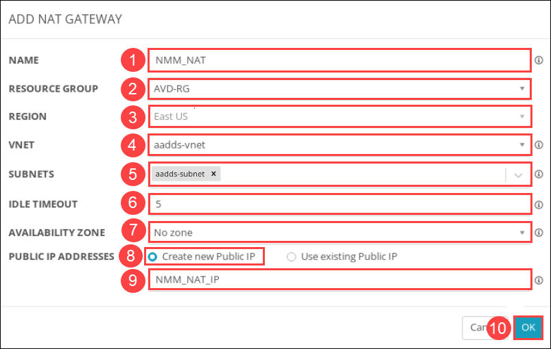

# Lab 7: Configure Network by adding NAT Gateway

## Overview

Virtual Network NAT (network address translation) simplifies outbound-only Internet connectivity for virtual networks. When configured on a subnet, all outbound connectivity uses your specified static public IP addresses. Outbound connectivity is possible without a load balancer or public IP addresses directly attached to virtual machines. NAT is fully managed and highly resilient.

## Exercise 1: Configure NAT gateway using Nerdio Manager

In this exercise, We'll be configuring the NAT gateway for the existing virtual network and assign a new public IP address.
   
1. On the left-hand side blade click on **NETWORK** ***(1)***, Select **NAT Gateway** ***(2)***, and click on **Add NAT Gateway** ***(3)***.

   
   
1. Under **ADD NAT GATEWAY** window, Provide the following details, and Click on **OK** ***(10)***

   - NAME: **NMM_NAT** ***(1)***
   - RESOURCE GROUP: Select **AVD-RG** ***(2)*** from the drop down
   - REGION: **<inject key="Resource group Location" enableCopy="false" />** ***(3)***
   - VNET: **aadds-vnet** ***(4)***
   - SUBNETS: **aadds-subnet** ***(5)***
   - IDLE TIMEOUT: **5** ***(6)***
   - AVAILABILITY ZONE: **No Zone** ***(7)***
   - PUBLIC IP ADDRESS: Select **Create new Public IP** ***(8)*** and provide name as **NMM_NAT_IP** ***(9)***

   
   
1. Once the NAT gateway is created, You'll be able to see it under the NAT GATEWAY.

   

1. Click on the **Next** button present in the bottom-right corner of this lab guide.

