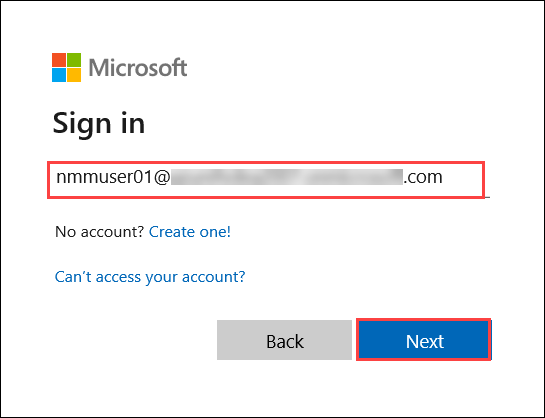
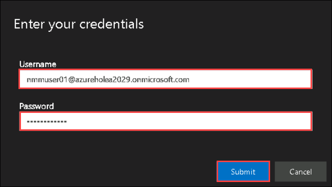
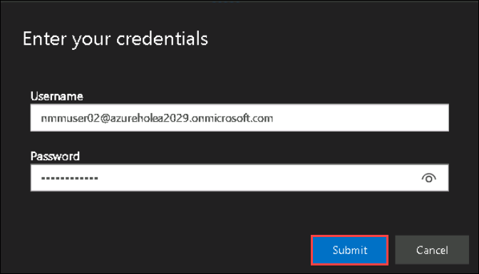
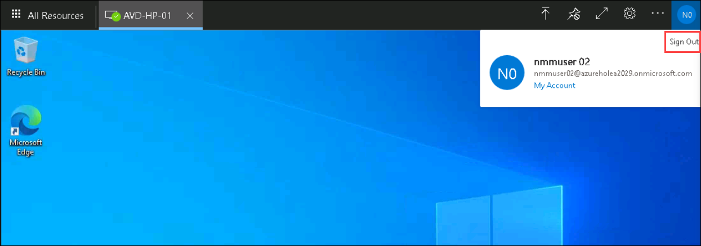
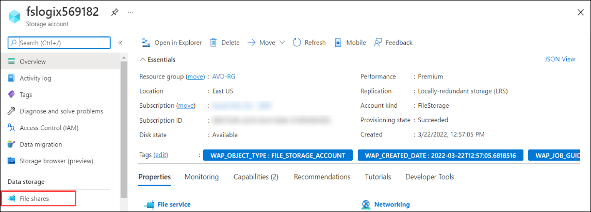
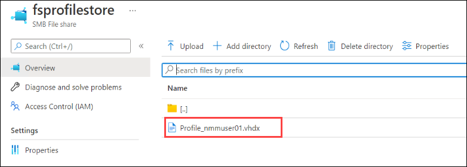

# Lab 8: Access the Desktop using Browser

## Overview

Azure Virtual Desktop (AVD) integrates virtual desktop infrastructure (VDI) and the cloud. AVD is Microsoft Azure’s platform-as-a-service (PaaS) offering from Microsoft. It enables small to large cloud consumers to provide remote applications and full desktops from Microsoft cloud to their end-users. Azure Files is also a  platform service (PaaS) and is one of the recommended solutions for hosting FSLogix containers for AVD users. In this lab, you'll be accessing the Desktop using the AVD Desktop Client and verifying the User profiles stored in the File share

## Exercise 1: Access the Desktop using AVD Desktop Client

In this exercise, we will access the Desktop and RemoteApps assigned to us in the previous exercise using AVD session from Browser.

1. Open the following URL in a new browser tab in the JumpVM. This URL will lead us to the Remote Desktop Web Client.

   ``` 
   aka.ms/wvdarmweb 
   ``` 
   
1. Enter your **credentials** to access the workspace.

   - Username: *Paste your NMMUser 01 username* **<inject key="Nmm User 01" />** *and then click on **Next**.*
   
   

   - Password: Paste the password of ***nmmuser01*** which you had copied earlier *and click on **Sign in**.*

   
   
   >**Note:** If there's a popup entitled **Help us protect your account** click **Skip for now (14 days until this is required)**

   
   
1. In the All Resources tab, Click on **AVD-HP-01** icon to access the session desktop.

   
   
1. In Access local resource pop-up window, Click on **Allow**.

   
   
1. In Enter your Credentials pop-up window, Provide the Username and Password of NMM User 01 and click on **Submit**.

   
   
1. Once logged into the session host, Search for **Word** application using the search bar. We won't be able to find the application as NMM User 01 is not part of AVD MSOffice users group.

   
   
1. Sign out from the session host by clicking on the **sign out** from top-right corner.

   
   
1. Enter your **credentials** to access the workspace.

   - Username: *Paste your NMMUser 02 username* **<inject key="Nmm User 02" />** *and then click on **Next**.*
   
   

   - Password: Paste the password of ***nmmuser02*** which you had copied earlier *and click on **Sign in**.*

   
   
1. In the All Resources tab, Click on **AVD-HP-01** icon to access the session desktop.

   
   
1. In Access local resource pop-up window, Click on **Allow**.

   
   
1. In Enter your Credentials pop-up window, Provide the Username and Password of NMM User 01 and click on **Submit**.

   
   
1. Once logged into the session host, Search for **Word** ***(1)*** application using the search bar. We will be able to find the **Word application** ***(2)*** as NMM User 02 is part of AVD MSOffice users group. This confirms the working of App masking rule set.

   
   
1. Sign out from the session host by clicking on the **sign out** from top-right corner.

   
   
## Exercise 2: Verifying the User profiles stored in the File share

In this exercise, you'll be verifying the user profiles stored in a file share in the Azure portal.

1. From the Azure Portal, search for *storage accounts* in the search bar and click on **Storage Accounts** from the suggestions.

   
   
1. Select the **fslogix{deploymentid}** storage account which was created while creating the NMM account.

   
   
1. Select **File shares** from the left side menu.

   
   
1. Click on the **fsprofilestore** file share.

   
   
1. You will see the user folder created in the file share, click on the folder.

   
   
7. Now you will be able to see the user profiles data stored in the filesharers in a ***.vhd*** format.

   
     
14. Click on the **Next** button present in the bottom-right corner of this lab guide. 
    
